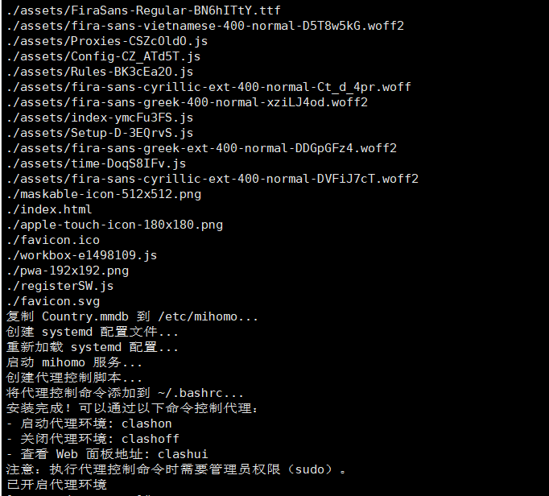
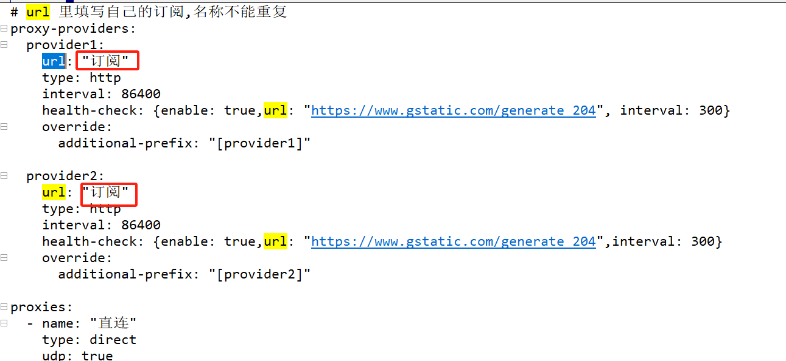
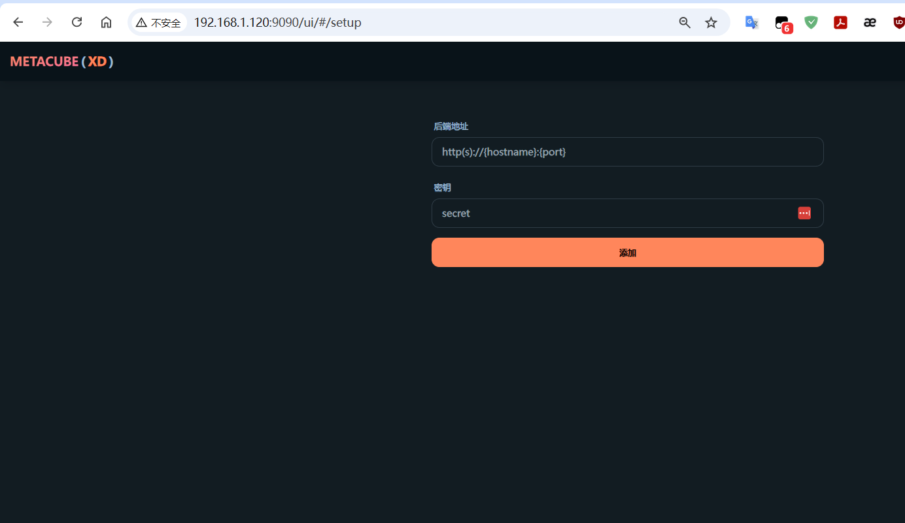
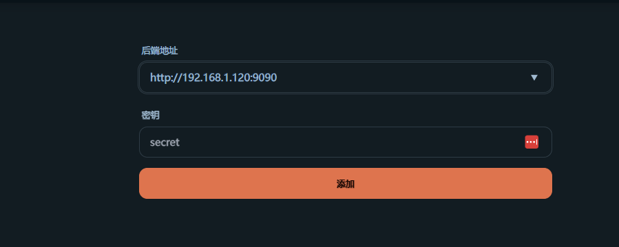
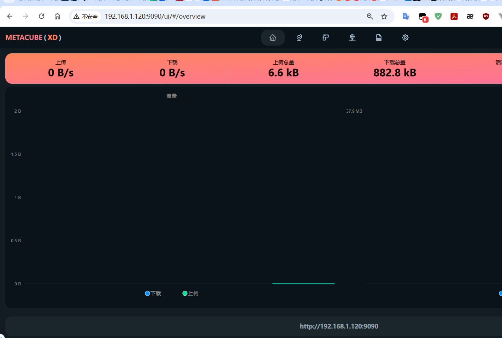

# Linux 一键安装 mihomo (新版clash、Clash Meta）

Linux 一键安装 mihomo (新版clash、Clash Meta）   

## 环境要求

需要 root 或 sudo 权限。

具备 bash 和 systemd 的系统环境。

已适配：CentOS 7.x Rocky linux ,Debian和Ubuntu 稍微改动一下bashrc路径即可

## 开始使用

一键安装 

```
git clone https://githubfast.com/tianyufeng925/mihomo-for-linux-install.git && cd mihomo-for-linux-install && sudo bash -c '. install.sh; exec bash' 
```


上述脚本已使用[代理加速下载](https://githubfast.com)，如克隆失败请自行更换。

## 命令

- 启动代理环境: clashon
- 关闭代理环境: clashoff



## 添加订阅

替换 /etc/mihomo/config.yaml 里面的订阅即可

```
vi /etc/mihomo/config.yaml
```



重启clash即可

```
systemctl restart mihomo
```

## 进入面板

输入 服务器ip+9090/ui即可



点击添加



即可



## Thanks

[@nelvko](https://github.com/nelvko)

[clash-for-linux-install](https://github.com/nelvko/clash-for-linux-install)
